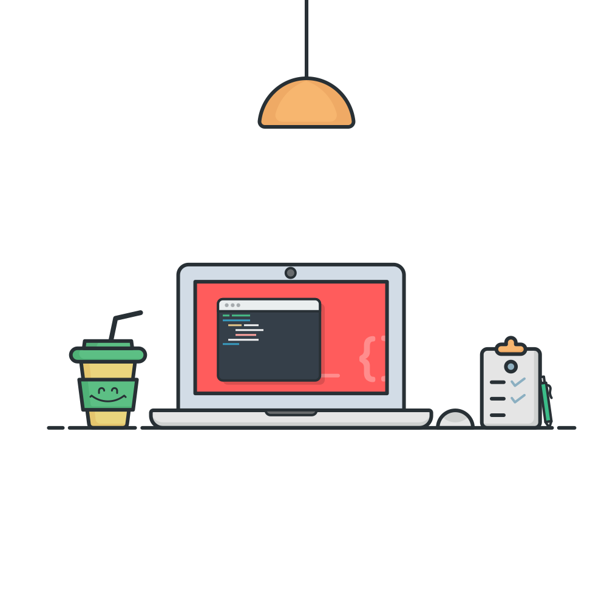

<p align = center>

</p>
<h2 align = "center">
🤟 Hello World 
</h2>

<p align = "center">
<a href = "https://discord.gg/zda6ZYbB25"></a>
<a href = "https://twitter.com/szymon_wilczek"></a>
<a href = "https://open.spotify.com/user/bmudli66dul1oqktfynzr4quv"></a>
</p>




### About Me!

```
● I'm currently working in T-Mobile Security Services.
● I'm currently working with Node.js.
● I started coding about 10 years ago.
```

### Tools

|| | | | |
|--|--|--|--|--|


### Languages & Libraries

| |   | | |  | | 
|--|--|--|--|--|--|


<h3>Github Stats</h3>


| [](https://github.com/szymonwilczek) |  |
|--|--|


