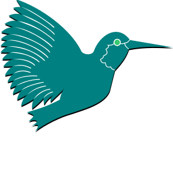

<h2>👋 Hi! </h2>

<em>Cybersecurity technician and React Developer.</a> 
</em>

    

    

**LANGUAGES AND TOOLS:**

 
 

<code></code>
<code></code>
<code></code>
<code></code>
<code></code>
<code></code>
<code></code>
<code></code>
<code></code>
<code></code>

#

<code></code>
<code></code>
<code></code>
<code></code>
<code></code>
<code></code>
<code></code>
<code></code>
<code></code>

 
 

#

  <g-emoji class="g-emoji" alias="chart_with_upwards_trend" fallback-src="https://github.githubassets.com/images/icons/emoji/unicode/1f4c8.png">📈</g-emoji>
  <strong>GitHub Stats : </strong>

 

    
    

 

#

  <g-emoji class="g-emoji" alias="chart_with_upwards_trend" fallback-src="https://github.githubassets.com/images/icons/emoji/unicode/1f4c8.png">📈</g-emoji>
  <strong>WakaTime Stats : </strong>

 
 

<!--START_SECTION:waka-->

<!--END_SECTION:waka-->

